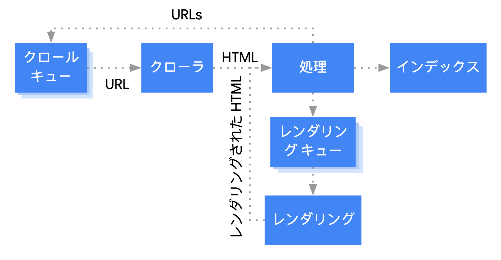

<!-- header: "SEOについて" --->
<!-- footer: "©mori-kei" --->

# SEO について

- Google インデックスとクローラー
- サイトマップ
- Indexing API

---

# Google インデックスとクローラー

---

# Google インデックスとは？

- Web ページが、Google の検索エンジンに登録されることを指す
  - クローラーがウェブ上で見つけたページからテキスト、画像、動画をダウンロード
    - ほとんどのファイル形式をサポートしている
      - https://developers.google.com/search/docs/crawling-indexing/indexable-file-types?hl=ja

---

# Google クローラー

- いわゆる、Googlebot
- Googlebot は、平均して数秒に 1 回を超える頻度でサイトにアクセスすることはない
- robots.txt に記述してクロールできないようにブロックしたり、インデックスされないように設定することもできる

---

# Google クローラーが登録するまで、

- 通常のユーザーが見るような流れで見られている
  

---

# インデックス登録時に行われていること

- テキストコンテンツや主要なコンテンツのタグや属性,画像や動画を処理して分析している
- Google はページがウェブ上の別のページの重複ページであるか、または正規ページであるかを判断する
  - Google は同じような内容のページが複数ある場合に、どれをメイン（正規）ページとして扱うかを決めるプロセスを実施します。例えば、同じコンテンツが異なる URL で公開されている場合、Google はどの URL を優先的にインデックスするかを判断します。

---

# インデックス登録で起こりがちな問題

- ページのコンテンツの質が低い
  - 技術要件
    - ページが機能している
  - スパムに関するポリシー
    - クローキング,ハッキングされたコンテンツ 等
- Robots meta ルールによってインデックス登録が禁止されている
  - <meta name="robots" content="noindex">

---

# サイトマップ

---

# サイトマップとは

- サイトマップとは、サイト上のページや動画などのファイルについての情報や、各ファイルの関係を伝えるファイルです。Google などの検索エンジンは、このファイルを読み込んで、より効率的にクロールを行います。
- サイトマップは xml ファイルや、RSS、mRSS、Atom 1.0 やテキスト サイトマップの形式で送れる

---

# サイトマップとは

- 例えばこんな感じ

```xml
<?xml version="1.0" encoding="UTF-8"?>
<urlset xmlns="http://www.sitemaps.org/schemas/sitemap/0.9">
  <url>
    <loc>https://www.example.com/foo.html</loc>
    <lastmod>2022-06-04</lastmod>
  </url>
</urlset>
```

---

# サイトマップの作成の仕方

- 手動
- CMS で自動作成
- ツールを使用してサイトマップを自動生成する
  - 例:https://www.xml-sitemaps.com/

---

# サイトマップの送信の仕方

- Search Console でサイトマップを送信する
- Search Console API を使用してプログラムでサイトマップを送信する
- robots.txt ファイルの任意の場所に次の行を挿入する

`Sitemap: https://example.com/my_sitemap.xml`

---

# サイトマップの使いどき

- 通常、サイトの各ページが適切にリンクされていれば、サイトのほとんどのページを検出できます。
- 以下のケースでサイトマップは有効
  - 大規模なサイト
  - 複雑なサイト
  - 専門性の高いファイルのクロールを改善したいとき

---

# こういう場合はサイトマップが必要

- サイトのサイズが大きい
  - サイズが大きいと、全てのページが一般的にサイズが大きなサイトでは、すべてのページがサイト上の他のページ（少なくとも 1 ページ以上）からリンクされていることを確認するのは難しくなります。その結果、[Googlebot](https://developers.google.com/search/docs/crawling-indexing/googlebot?hl=ja)  が新規のページの一部を検出できない可能性が高くなります。
- サイトが新しく外部からのリンクが少ない
  - Googlebot などのウェブ クローラーは、以前にクロールしたページにある URL にアクセスしてウェブをクロールします。そのため、他のサイトからのリンクがないページは Googlebot に検出されないことがあります。

---

# IndexingAPI

---

# IndexingAPI は何ができる？

- **URL を更新する**
  - クロールの対象となる新しい URL や、以前に送信した URL のコンテンツが更新されたことを Google に通知します。
- **URL を削除する**
  - サーバーからページを削除した後 Google に通知することで、Google がインデックスからそのページを削除し、URL を再度クロールしないようにします。
- **リクエストのステータスを取得する**
  - Google が最後に受信した、指定された URL に関する各種の通知を確認します。

---

# 具体的なリクエスト

- URL を更新する

```json
{
  "url": "https://example.com/page",
  "type": "URL_UPDATED"
}
```

---

# どういう時に有効か

- 即時インデックスしたいページがある場合
  - ドキュメントでは、**「Job Posting（求人情報）」と「Live Streaming Video（ライブ動画）」のページに対してのみ** Indexing API の使用を公式に推奨しています。
- ニュースや、EC サイトといった情報を即座に発信したいサイトの場合

---

# 🎯 まとめ 🎯

📌 **Google インデックスとクローラー**  
🔍 クローラーがページを見つけてインデックス登録！  
⚠️ 重複コンテンツや質の低いページは要注意！

📌 **サイトマップ**  
🗺 サイトの地図で Google に構造を伝えよう！  
🛠 手動 / CMS / ツールでカンタン作成  
📡 Search Console や robots.txt で送信 OK！

📌 **Indexing API**  
⚡ **即時インデックス！** すぐに検索結果に反映 ✨  
📰 求人情報＆ライブ配信ページに推奨 📢  
🏪 **EC やニュースサイト** でも活用のチャンス！

---

# 🚀 **SEO を活用して、より多くの人に届けよう！** 🌍✨
